# 1.项目介绍
- 系统角色：学生，辅导员，企业
- 功能模块：企业消息管理、学生消息管理、就业信息管理、面试邀请管理、求职信息管理、投简信息管理、工作类别、企业管理、学生管理、辅导员管理等
- 技术栈：SpringBoot，vue，Layui等
- 测试环境:idea2024，jdk8，mysql5.7，maven3等
# 2.项目部署
- 创建数据库，并导入db下的sql文件
- 根据本地的数据库环境，配置src/main/resources/application.yml 11-14行
- 启动项目
- 后端管理web：http://localhost:8080/springboothch86/admin/dist/index.html  管理员账号密码：abo/abo
- 前端门户：http://localhost:8080/springboothch86/front/index.html  学生账号密码：学号1/123456、辅导员账号密码：工号1/123456，其他详见数据库
# 3.项目部分截图
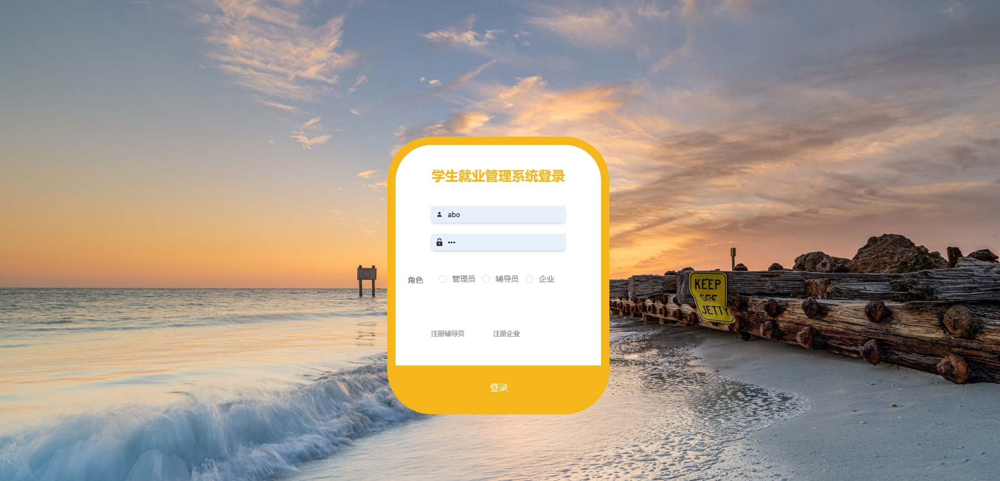
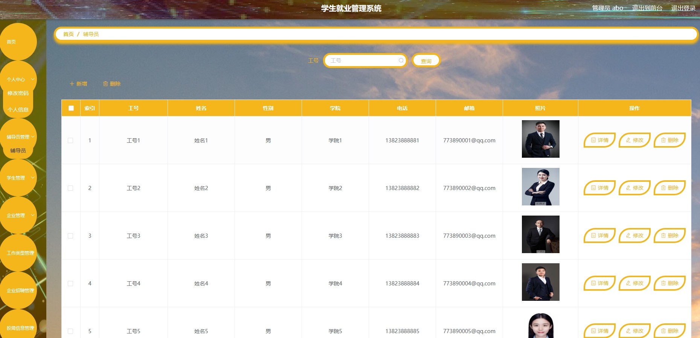
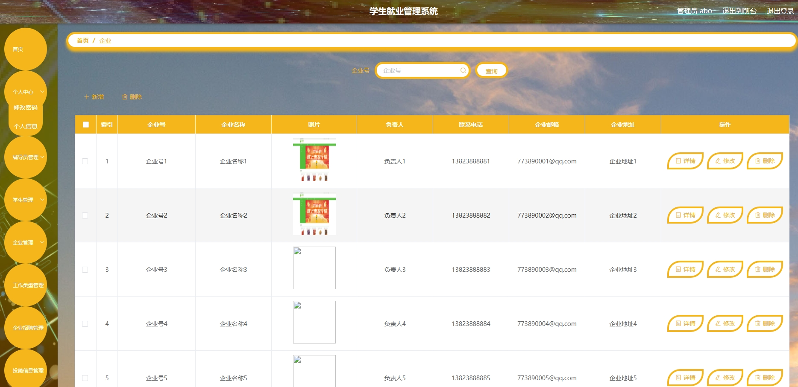
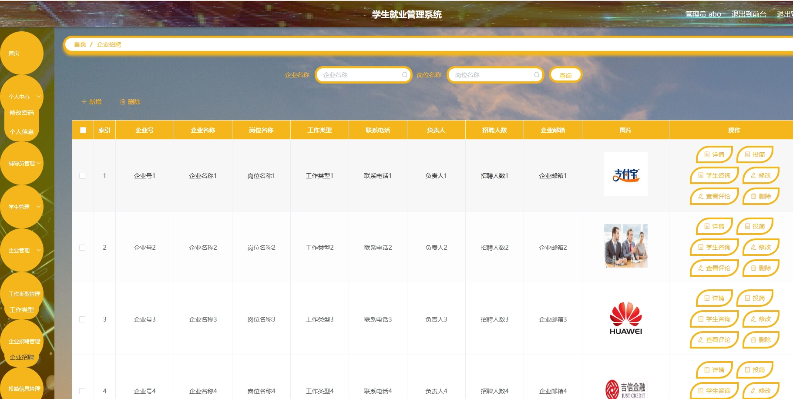
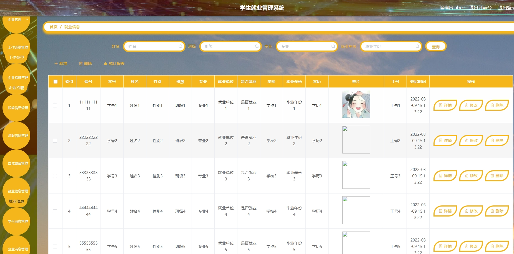
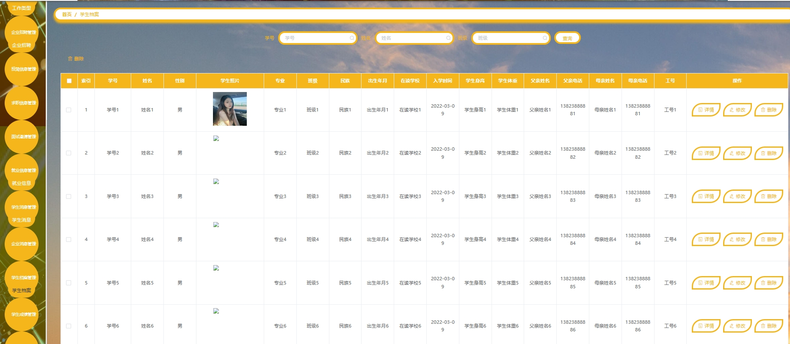
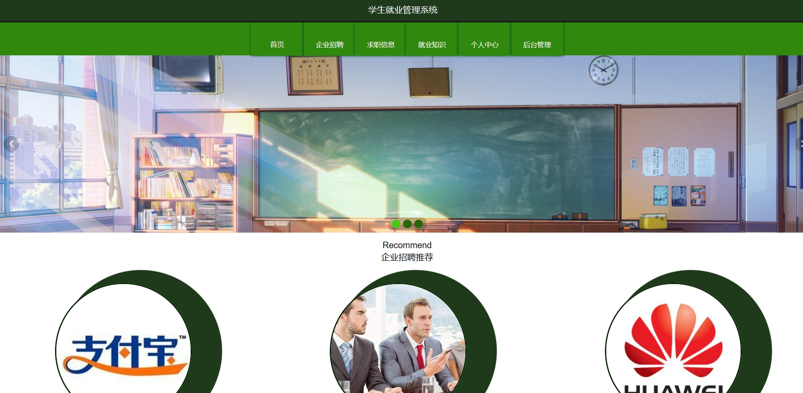
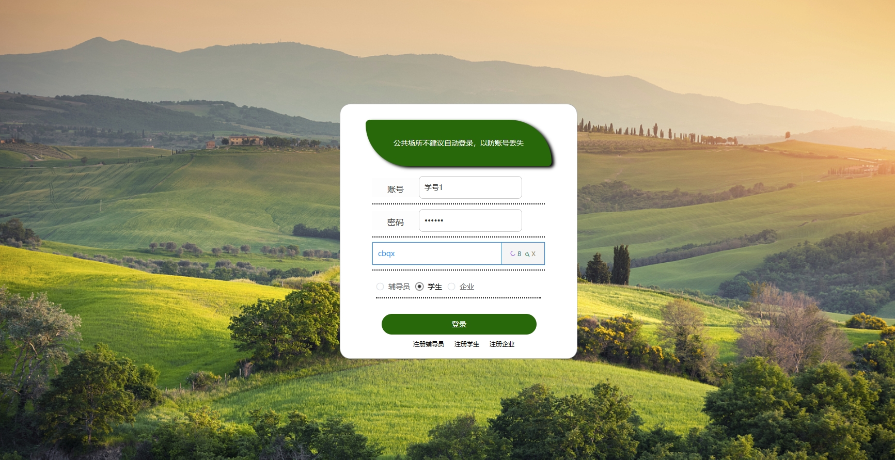
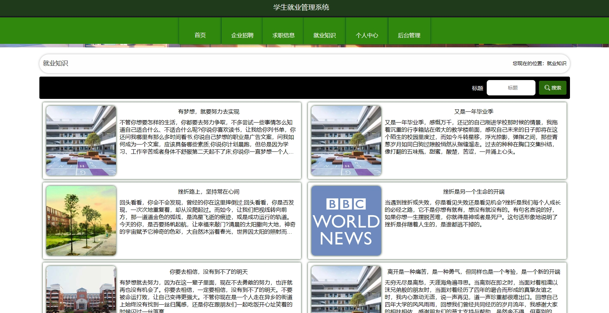

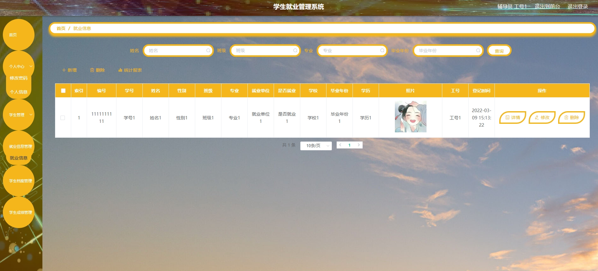
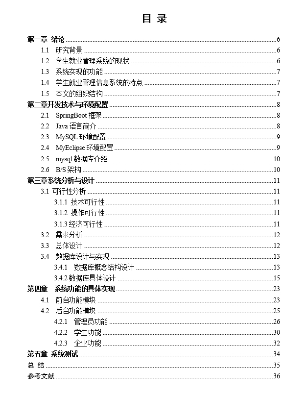
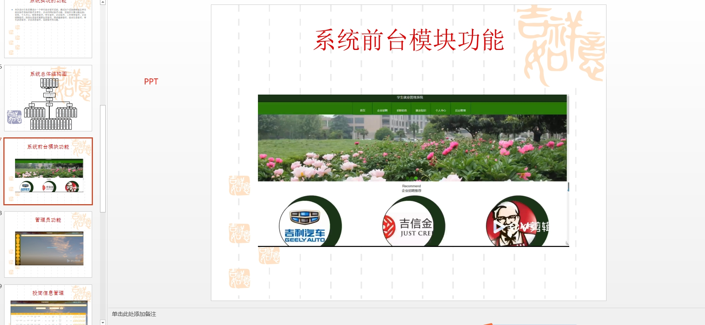

# 4.获取方式
[戳我查看](https://gitee.com/aven999/mall)
